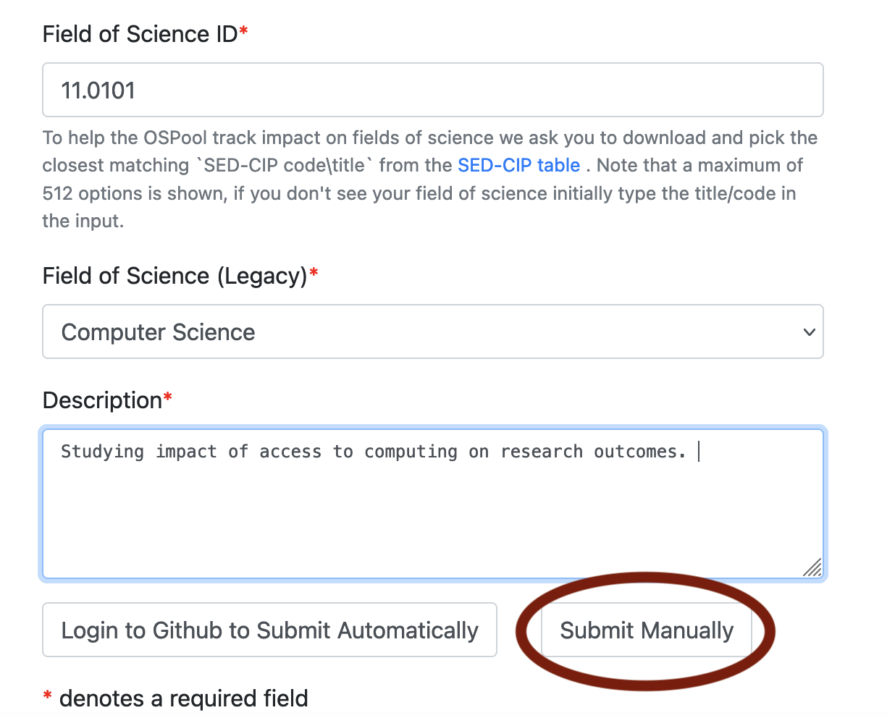
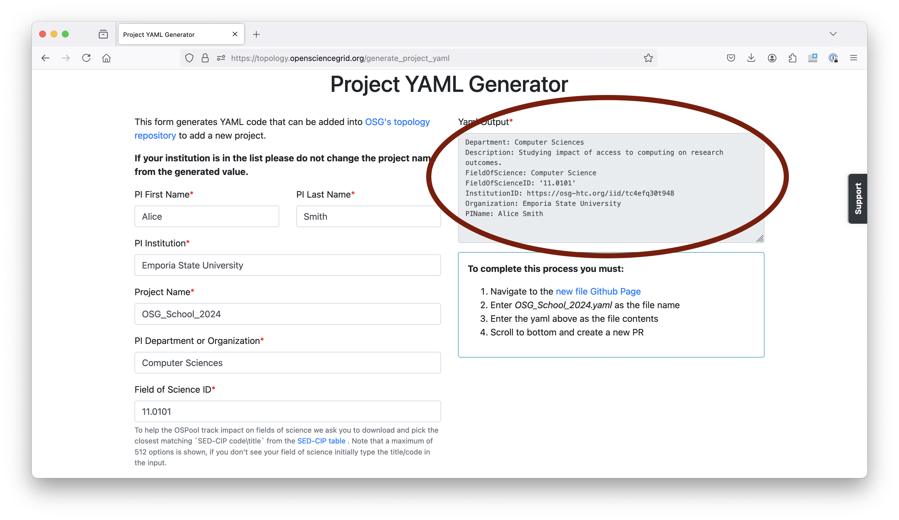

# Continue Your Access to the OSPool

Any U.S.-based researcher with an academic affiliation can use the OSPool indefinitely, with no allocation 
or cost to you. Your access to the OSPool is temporary—if you'd like to continue your access to the OSPool, follow the instructions below!

## Option 1: Schedule a consultation at the School (preferred)

To continue using your account beyond the School, please schedule a consultation with one of the facilitators during the School! Information on how to schedule a consultation will be provided at the School or via Slack.

In this consultation, we'll chat with you one-on-one about your research and help set up a project to ensure you can use the OSPool for your research computing needs!

## Option 2: Submit an application after the School

If you are unable to schedule a consultation during the School or decide to continue your access at a later date, complete the following steps.

Please complete the following steps by July 31: 

1. Go to this link: [Project Creation Form](https://topology.opensciencegrid.org/generate_project_yaml)
1. Fill out the form.

    !!! note
	    If the Project Name doesn't auto-populate, use `OSG_School_2025`. 
	
	After completing the form, click "Submit manually": 
	
	

1. Send an email to [support@osg-htc.org](mailto:support@osg-htc.org) with the following: 

    1. Include the text of the project creation form (see image below). 

	

    1. CC the PI of your research group, asking them to confirm your membership. 
	in their group. If you are the PI, that should be indicated in 
	the email. 

1. If you are not the PI of your research group, make sure your PI replies to 
your email to confirm that you are working with them!!

Once the project PI has confirmed your membership, OSG Facilitators will create a new 
project of the form `Institution_PIName`. You will receive
a notification when you are added to the new project, and a follow up email from 
the OSG facilitation team. 